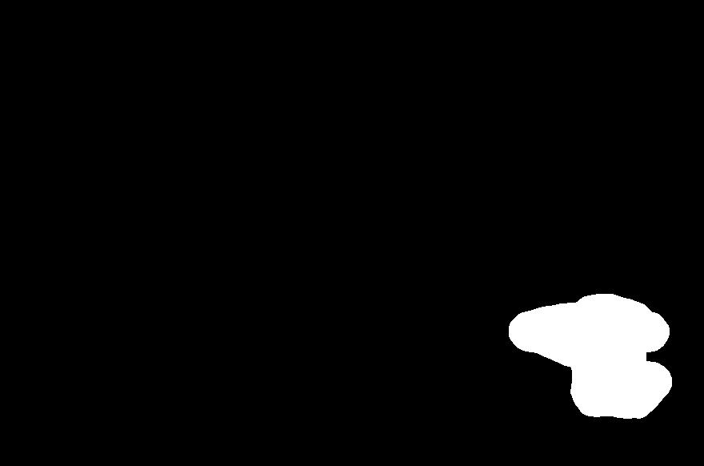

# Use Case
This repository is mainly used to make mask image from painted image. And this is mainly established to use this [Object Remover API](https://rapidapi.com/firdavscoder1/api/object-remover)

```python
if __name__ == "__main__":
   main(
        path_to_original_image="original.jpg",
        path_to_painted_image="painted.jpg",
        path_to_output_image="mask.jpg"
   )
```

| Original| Painted | Mask |
| ------ | ------ | ------ |
|  |  |  |